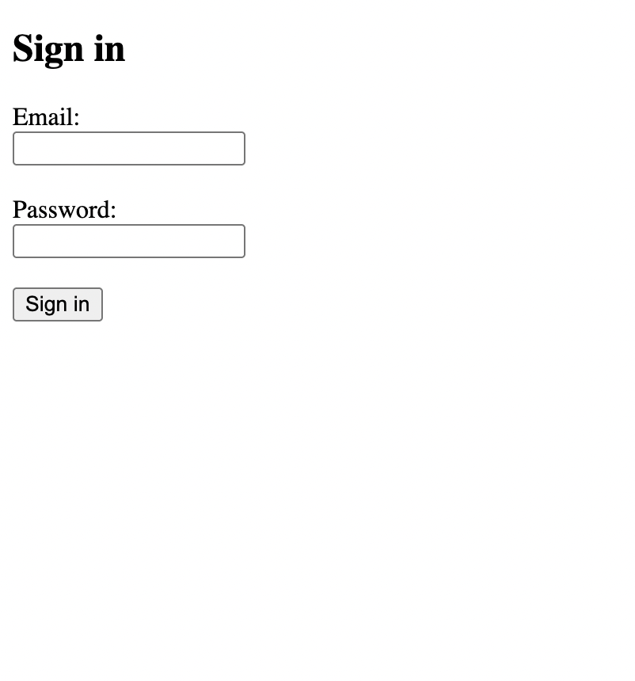
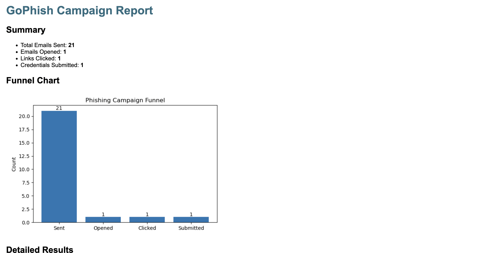

# GoPhish Reporting Project

This project is a **Social Engineering / Phishing Simulation** conducted as part of the **Cybersecurity Specialist Internship Program at Acunmedya AkademiQ**.

NOT: Bu proje, GoPhish ile gerçekleştirilen sosyal mühendislik testine ait verilerin toplanması, analiz edilmesi ve HTML formatında raporlanmasını içermektedir. 21 kişilik hedef grup üzerinde yapılan test sonucunda kullanıcı etkileşimleri (e-posta açma, bağlantıya tıklama, bilgi gönderme) analiz edilmiştir.

## 📌 Project Summary

The purpose of this project is to simulate a phishing attack scenario using **GoPhish**, a popular open-source phishing framework. This simulation includes the full lifecycle of a phishing campaign, from email delivery to data collection and reporting.

> **⚠️ Legal Disclaimer:**  
> This simulation was performed in a fully legal and controlled environment. Only one phishing email was sent and confirmed by my own personal backup email for demonstration and reporting purposes.  
> No real users or organizations were targeted.  
> The objective was strictly educational.

---

## 🚀 Project Flow

1. ✅ **GoPhish installation and configuration**
2. 📩 **Creation of a phishing email template**
3. 🎯 **Launch of a simulated phishing campaign**
4. 🧪 **Tracking clicks and captured credentials**
5. 📥 **Exporting results to CSV**
6. 📝 **Generating a detailed HTML report from Excel using a custom Python script**
7. 🖼️ **Visual documentation and screenshots**

---

## 🛠️ Technologies Used

- 🐍 Python
- 📊 CSV parsing
- 🧰 GoPhish
- 💻 HTML + CSS (for report)
- 📷 Screenshots for visual documentation

---

## 📸 Screenshots

| Fake Login Page | Report Output |
|-----------------|----------------|
|  |  |

---

## 🧠 Learnings & Goals

- ✔️ Gained hands-on experience with phishing simulations using GoPhish
- ✔️ Learned how to ethically conduct and report a social engineering test
- ✔️ Improved Python scripting skills for data transformation
- ✔️ Developed a custom HTML reporting system
- ✔️ Practiced documentation and visualization for cybersecurity operations

---

## 📌 About the Author

**Hüseyin Çelik**  
Cybersecurity Intern @ Acunmedya AkademiQ  
💼 Interested in SOC operations, Ethical Hacker, Cybersecurity Analyst
🔗 GitHub: https://github.com/huseyincelik1

---

## 📜 License

This project is shared for **educational purposes only** and is not intended for malicious or unethical use.
